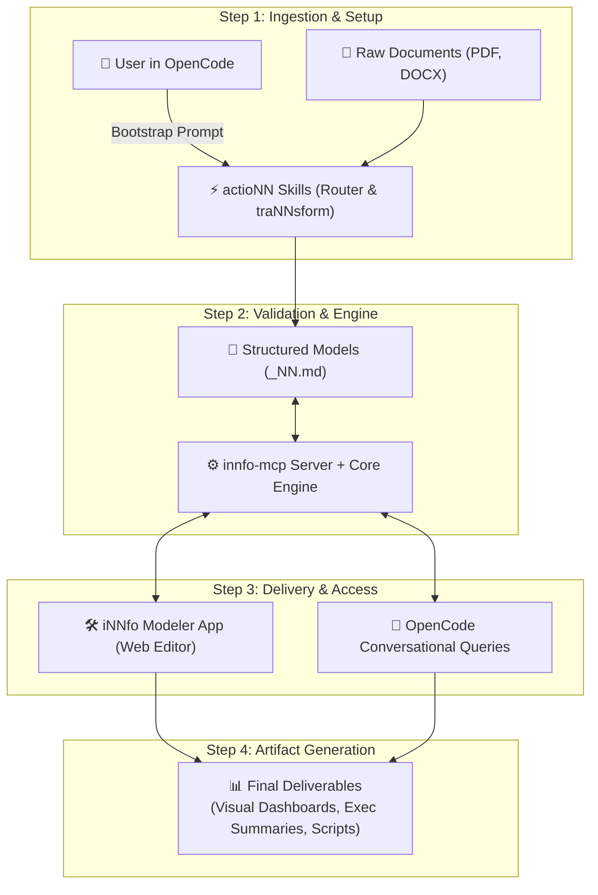

# Transform your documentation into structured, validated knowledge models.

Model, edit, and query knowledge visually in your browser or conversationally with your OpenCode AI agent.

- [Open iNNfo Modeler App](https://innfo.cognnitive.com/app/)
- [Explore Documentation](https://innfo.cognnitive.com/documentation/)

---

## What You Can Do With iNNfo

- **Visual Modeling**: Explore your documentation as interactive graph trees, block sheets, matrices, and visual diagrams.
- **Automatic Validation**: Catch broken links, missing properties, and outdated specs automatically as you edit.
- **AI & Web Editing**: Edit visually in the browser app or ask your OpenCode AI agent to create and update models for you.

---

## Information & Engine Architecture

---

## Use iNNfo Directly in OpenCode

1. **Open OpenCode Desktop**: Launch OpenCode Desktop and open your project folder containing your documentation.
2. **Prompt Your Agent**: Tell your agent: `I want to use https://cognnitive.com/use`
3. **Create & Edit Models**: Ask OpenCode to create an iNNfo model or validate your documentation.
